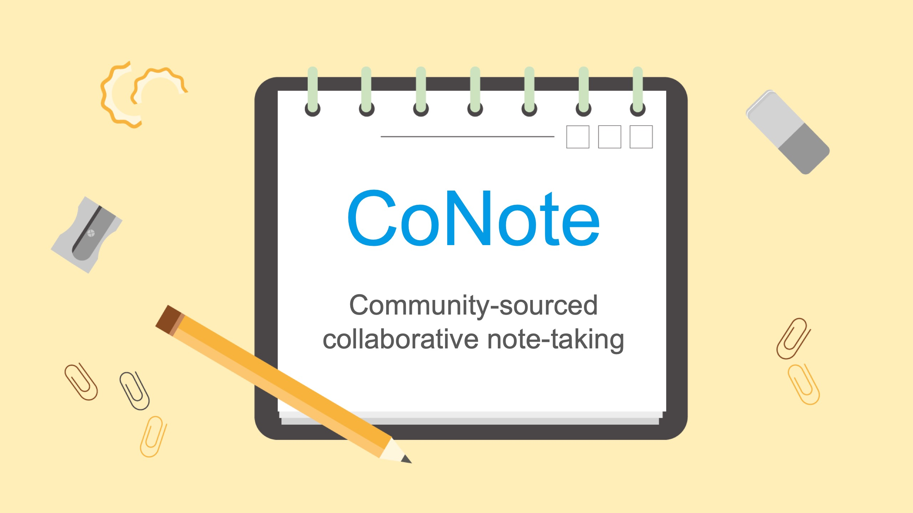

# CoNote

Repository for CS473-Introduction to Social Computing project

## How to run Server
1. `cd server && npm install`
2. `npm start`

## Environments
- Node 12.13.0 LTS
- npm 6.12.0
- Express.js
- React.js

## Todos
Please add!!

### Client
React.js as a clientside framework

#### Pages
- Home
- Course lists
- Note-taking page
- Feedback page
- Outline revising page

### Server
Use Express.js as a serverside framework
- Link Client(React) - Server(Express) - DB(Mongo)

### Database
MongoDB

## Authors
- Dorjnyam T.
- Sangwoo Kim
- Jiwoong Na
- Jinyoung Sung

