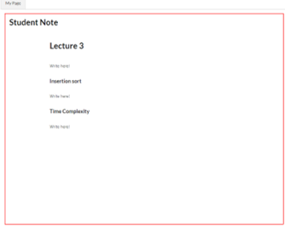

# CoNote

Report for CS473-Introduction to Social Computing project

## Project Summary 
Separate note-taking by one student is not efficient enough to review all lecture, because students can miss some classes or misunderstand some lessons.
Our solution is providing note sharing platform, “CoNote”, where students can upload their notes, refer to other notes, and exchange feedback about note.
Students only who upload their notes or give feedback to other notes can refer to other students notes, and users can see list of notes in order of ratings scored by users.

## Client
 ### How to use it
 - **First page**: There are two parts: Courses list, and my notes list. In my notes list, You can see your notes that you wrote and revise them. You can go to course page by choosing a specific course in the course list.
 - **Course page**: There is a list of notes including your notes, and other users notes. The list of notes are ordered in rating scored by other users, in this page, you can add your new note. 
 - **Note taking page**: You can upload your new notes by manually writing down on the web, or simply uploading your notes in the form of pdf, or jpg. You can write down the question to get an answer from feedback. - It will be implemented.
 - **Note page**: If you click a note in the course page, you can see the note on the left side, and feedback for the note on the right side. You can give feedback to the note simply type in your feedback, and you can rate the note or feedback. If you are in note page which is yours, then you can also revise the current note.
 - **Feedback**: You can get feedback from, or give feedback to other users. Feedback can be recommended revision or better solutions for other users notes, or it can be an answer for the question on the note.
 - **Rating system**: Users can score the notes in 5 star score, and this rating affect the order of the list of the course’s notes.  There are also rating for feedback, and it is ‘like-unlike’ system. Feedback rating system is processed as hard-coded.
 - **Permission**: Not every user can see all the notes. Users have to give feedback to other notes periodically. Otherwise, users’ permission to access to other notes will be lost. However, if someone’s feedback get high rated by other users, period will be extended for some days. 
 - **Login**: Users have to login the CoNote to upload notes, exchange feedback, and rates. We make this as hard-coded. 

### Example Runs (Scenario)
 - end-to-end scenario 1 : A user missed the class, so the user wants to see other student’s lecture note.
 Home -> Course -> mandatory feedback -> lecture notes & feedbacks.
 - end-to-end scenario 2 : A user took a lecture note and wants to share the note with other students to help them.
 Home -> Course -> Share a note
 - end-to-end scenario 3 : A user took a lecture note but not sure note was correctly taken. So the user wants to ask students some questions about the lecture and the lecture notes.
 Home -> Course -> write a note -> my notes -> my feedbacks
 - end-to-end scenario 4 : A user wants to rate other’s lecture notes by how useful were they.
 Home -> Course -> rating lecture notes

----- Screen Shot ------------

   
           

------------------------------

## Prototype
http://143.248.138.190:3000/

## Implementatino Notes
https://github.com/nanamindoko/conote
https://github.com/jysung710/conote-server

 #### Libraries and Frameworks used
  - React.js as a client side library
  - MongoDB
  - Express.js
  - Node.js
  - Bootstrap
  - Firebase

## Individual Reflections
 - `Jinyoung`
#### Which part of the system did you directly contribute to?
I’ve designed the schema of our data, and implemented the api server with Express.js framework. 
 
#### What were some of the difficulties you faced?
Since there was no-one who could use Angular.js framework, which I usually use for my own web project, we decided to use React library. It was first time using it, so it was hard to figure out how to link client-side web with the server.
Early on our project planning, we thought using database system is beyond our gaol because it was not part of our core features. I failed to implement it with simple filesystem, and had to change the plan to use DBMS.
 
#### List one useful skill you learned while working on the high-fi prototype
During several design pitches and feedback, I’ve learned how to clarify the goal of our project and how to change development direction to satisfy our goal. 

 - `Sangwoo`
 Most of my contribution to project is designing social interactions in the project. Mutual feedback system, out-of-five-stars note rating system and iterative mandatory feedback is my contribution to the project. Especially, note rating system is a feature that newly introduced in high-fi prototype. I also implemented some codes, which meant to be front-end view of a ‘my page’ and ‘my feedback’ page. However, we decided to change routing mechanism in a midway of development, so my codes became obsolete.
There were several difficulties my team and I faced. First difficulty was to redesign our project during implementation. After getting feedback of low-fi prototype we made, we had to get rid of all the confusing ideas that were related to ‘master note’ and ‘edit history’. It changed our member’s role for the project. Someone have to think more on improving our design. Since then my contribution focused more on design. Second difficulty was the redesigning itself. We simplified our system, but it caused some loss of incentive for students we had intended. So we had to invent clearer and more socially interactive device. We referred to other social computing pattern and try to find the most effective one. The rating system is a fruit of the process. Third and the last difficulty is that development task is not evenly distributed to each members. Since I was new to ReactJS, whenever I struggle with code of some page, the member with more experience already complete my task and did something more. I decided to deploy my own webpage to learn more advanced web development someday.
One implementation skill I learned from the high-fi project is basic of ReactJS. Before I learn it, I have used only basic html and css. Now I learn some more advanced ReactJS pattern such as editor.

 - `Jiwoong`
I contributed on designing strategy and some UI for making users to participate to the social interaction more actively. After the low-fi, considering that merging system of CoNote is too heavy to implement, and hard to decide the methods, so I suggested the system where users can just sharing the note, without merging. I also suggested the mandatory feedback system using time interval, and rating that gives users more period to refer to other notes.
It was tough to understand the structure of the framework, due to the lack of experience. ReactJs and Database were unfamiliar to me, and so were some libraries, so I had to study ReactJS from the basic structure of the framework.
In the point of UI, it was hard to think more accessible, and usable design, and structure of application.
In order to make users share note easily, one of the most important point is managing a huge number of  notes so that users can easily find and refer to high quality shared notes and feedback. Using rating system, we think that we can handle the management, because users will be able to find high rated notes. The 'merged note' idea was too complicated and hard to implement not only because of coding, but also the strategy of merging. The gap among each member's experience for development was one of the problems. Actually I didn't have any experience of developing an application, so I tried to study borrowing books and searching the Internet, but I think it was not very useful for our team's development.
However, during the high-fi implementation, I could know structures about ReactJS project, and some useful frameworks and libraries.

 - `Dorjnyam`