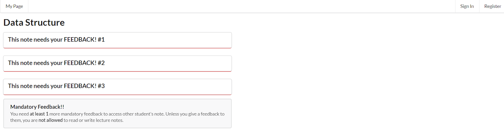
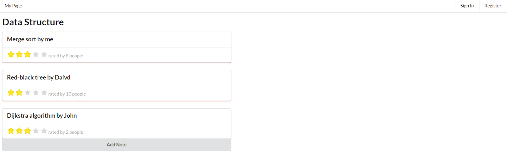

# CoNote : Final Report

---

## Quality Argument
There are some great features in our interface and we will explain why it is great. These are Mandatory Feedback and the note editor.

**1. Mandatory Feedback**

This is screenshot of our interface before you write a mandatory feedback.
    

This is screenshot of our interface after you write a mandatory feedback.  

&nbsp;&nbsp;&nbsp;&nbsp;Mandatory Feedback is one of the most novel features of Conote. If a user hasn’t written feedback for any notes, the user can’t access to anyone’s note. The user has to provide the feedback for note selected by Conote system. After user gives enough numbers of feedback, then the user can access to every note.   
&nbsp;&nbsp;&nbsp;&nbsp;This feature is necessary part of Conote. The most important driving force of Conote system is its mutual feedback system. Because of feedback, students would share their notes deliberately. So we have to make sure of minimal amount of useful feedback. The Mandatory Feedback is a good solution for this. This also prevents increase of freeloaders.  
&nbsp;&nbsp;&nbsp;&nbsp;This feature is great for two reasons. First, this is really novel feature. Based on our team’s knowledge, there is no such feature implemented from current education services. Second, we designed this system in great detail. We designed mandatory feedback to be iterated in certain period, for example, one week. If mandatory feedback is all done on first week, no one would like to give another mandatory feedback after that week, which is not a situation we want. We also make the title of notes in need of mandatory feedback blinded. This is prevent feedback givers to have any bias on notes based on title and writer of the notes. And also, the minimal number of mandatory feedback also can be adjusted. These details make this feature great.  

**2. Note editor**

*This is a screenshot of our note editor.

*This is a screenshot of what our note editor can do, including text effects, table, lists and code.  
  
&nbsp;&nbsp;&nbsp;&nbsp;Our note editor is a well-received features of Conote. Using our editor UI, user can write lecture note easily. According to user survey, note UI helps their task to fill in and upload lecture notes. Some users left comments that they wish our UI support chemdraw, which is chemical molecule drawer, and math expression.
    
---
## Evaluation
  
&nbsp;&nbsp;&nbsp;&nbsp;Total 16 users participated in our prototype usertest. We could get some more positive reactions than we expected from users about the idea of platform where people share their notes. We could know that interaction between existing notes and feedback to those notes is easy to improve, but make users to upload their own notes voluntarily first is not an easy process.   
&nbsp;&nbsp;&nbsp;&nbsp;In the point of note referring other users note, most users considered it highly necessary, and some users even said they actually want to use the service if this note sharing service gets launched. However, the users considered the function simply sharing notes is not very unique function, because there are some sharing platforms such as google drive. In addition, some of them commented that they can not be sure that other users would use this platform and voluntarily upload their own notes first. However, they said that a  mandatory feedback system is a very good idea to control some free riders, and some users said that mandatory note uploading system would be better solution for preventing free riders rather than mandatory feedback system.   

  
  
&nbsp;&nbsp;&nbsp;&nbsp;In the note uploading task, there were much feedback about user interface. Many users wanted easier, and more convenient editor, which can edit mathematical formula and draw pictures. Especially, they wanted some linkage systems with other drawing or imaging programs, such as ChemDraw.  There was an opinion that commenting function directly in the note(not only in feedback page), like ‘Notion’ will be very good feature to use for the CoNote system. Some users even get confused about how they can upload own notes. One of the problems was that even though there were some functions that users wanted, users could not easily know that the function exists. For instance, users can upload photos in using the editor of CoNote, but there was some feedback that they need photo uploading function, which means our user interface is not  very intuitive and easy. Some users suggested inserting some explanations on user interfaces or providing a simple tutorial would be good for new CoNote users.  

  
  
  
&nbsp;&nbsp;&nbsp;&nbsp;The feedback system, which was a third task, got the best reaction from the users and positive feedback. Many users said that the system that users can refer other notes and give feedback to the notes is the best feature of CoNote. It can be a strong feature for the platform in the point that users can use this system not only for opinion, but asking questions, and answer the questions also. With the mandatory feedback system, this feature got very positive reaction from users. However, there were also feedback about UI. One especially remarkable feedback was that applying google docs’ ‘suggestion’ function. Not only giving feedback on the feedback board, but also directly input the feedback on the note will be better feature for the CoNote. To improve social interaction between users, the idea of rating feedback and sorting the list of feedback using filter was also a good idea.  

  

  
  

---
## Discussion
  
&nbsp;&nbsp;&nbsp;&nbsp;Among the concepts from class, concepts that are most relevant to our interface are ‘peer production’, ‘quality control’ and ‘discussion/Q&A’.  
&nbsp;&nbsp;&nbsp;&nbsp;One of the most complex aspects of peer production is its incentive. We designed our interface to have intrinsic motivation, just like other notable peer production interfaces. To improve our motivation system, we inserted ‘mandatory feedback system’ in our design, which enforce users to give feedback to other notes before they refer, and therefore initial note uploaders can get advantages from their uploaded notes. However, we could expect that this motivation would be hazardous if users don’t understand the importance of feedback system. There are some improvement suggestions for this feedback system: ‘mandatory note upload system’, and ‘evaluation of feedback and rating system’ are examples of them. If we could improve it, we can do some experiment with gamification.  
&nbsp;&nbsp;&nbsp;&nbsp;The weakest feature of our interface is the quality control part. We can’t assure there will be useful feedback for students. We hope further implementation of reputation system would help this situation. Base on feedback from user testers, we can make sorting the list of feedback using filter system, and rating of feedback. If we can ban feedback trollers, or free riders, we may be able to control quality of feedback.  
&nbsp;&nbsp;&nbsp;&nbsp;Our system has a similar function to Q&A service. From user survey, we found out this function would work mostly well. From users, we got a suggestion that there should be a written guideline for what to feedback on student’s note. If this improvement is done, it would be supporting social interaction (Q&A) more successfully.  
  

---
## Individual Reflections
 - `Jinyoung`  

 - `Sangwoo`  
 &nbsp;&nbsp;&nbsp;&nbsp;Brainstorming was one thing worked successfully in our team. Whenever we meet for project, we usually got into good and novel idea. This process was good until low-fi prototype. After low-fi prototype feedback, there are two things that went wrong. First, we got a bad score, way behind average, and that discouraged us a bit. It is true that our plan had some flaws, we felt that either grading is harsh or our idea is bad. Second, our communication within team was ruined. We try to balance our work, but actual development was eventually done by only part of the member. We didn’t know that when front-end developer resigned to develop it until two weeks after resignation. We tried to amend problems right before the final presentation, but it was not enough to finish our interface. Next time, I would like to make sure that every member is in contact and finish our work with greater perfectionism.  
&nbsp;&nbsp;&nbsp;&nbsp;Through project, I learned that web-based GUI implementation is hard to modularized if there is no  standard among members. I think one expert member should set all standard and some base code so that a novice member can contribute more. And I also learned that improving the social computing design is to find weakness of design and to fix it. Through design process, we found new weakness of system every time we made a meeting. Next time, I would balance the time working on designing and time working on implementation.

 - `Jiwoong`  
&nbsp;&nbsp;&nbsp;&nbsp;We got great ideas in the ideation stage. We all had good ideas and upon those good ideas, we could decide the best idea among our ideas through discussion. In addition, we could make a rational distribution such as ‘design’, ‘human resource’, ‘frontend’, and ‘backend’, so our work went well on each part. However, because we thought that we made good distribution of roles, maybe we did not communicate enough. We did know some results, for example frontend user interface, but we did not know that how the actual code is being coded, and either backend each other. Finally, we all studied from the beginning about the frontend framework ‘react’, and started to make frontend together. We eventually made our prototype roughly, but I felt that we should have communicated with each other more actively, and not entirely distribute and separate. I learned that making role distribution is good, but we must know each other’s process at least. Plus, we must communicate with each other periodically to know whether there are any difficulties or problems on any tasks, so that other team members can help.  
&nbsp;&nbsp;&nbsp;&nbsp;The first thing I learned was that user interface design is very hard. I think the sentence professor Kim showed us is right. Second hard thing in social computing is human, and first hard thing in social computing is convince developer that human is hard. In the project, all our members thought that our first GUI design is very intuitive and easy to use, but even TAs thought that it is not intuitive and very hard to understand. Furthermore, during user test, even we improved our UI, some users said that there is something hard to understand, and they want some explanations.  
&nbsp;&nbsp;&nbsp;&nbsp;The second thing I learned was that we need enough communication among developers. I think it is not enough to simply talk about the progress of development. I think we have to know what should one part do to help other parts, and the plan of development as well as the progress of development. In addition, I learned that we also have to give feedback to each other to make better interface and understand users.  

 - `Dorjnyam`
